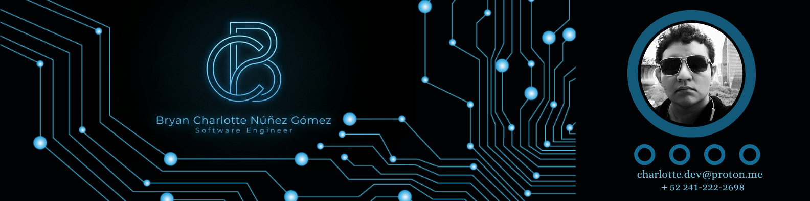
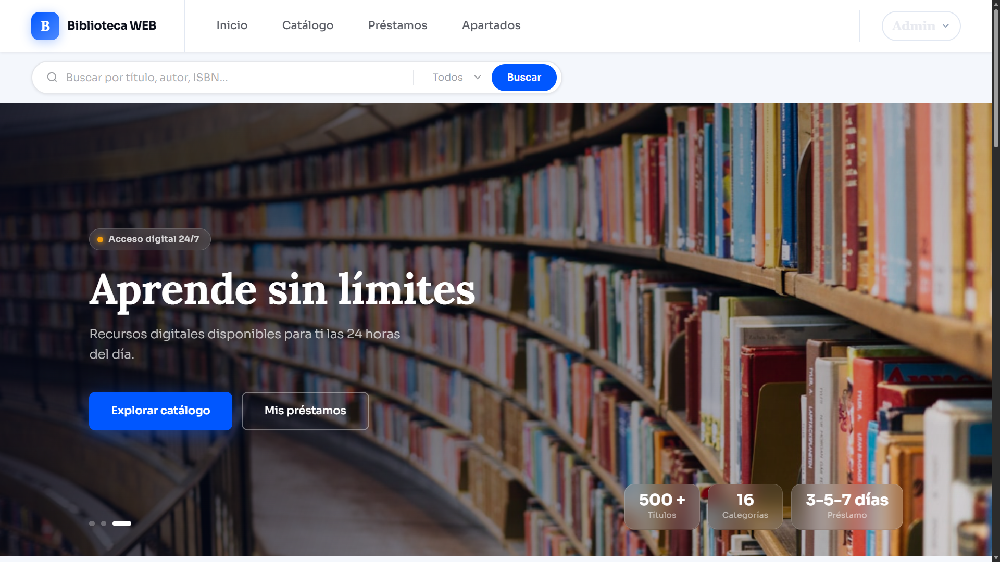

  

# 👋 Hola, soy Charlotte (`Charlotte-Developer`)

  🚀 Desarrollo Web | 📱 Apps Multiplataforma | 🧠 Arquitectura de Software

  

---

### 🎓 Ingeniero en TI e Innovación Digital en Formación | TSU en Desarrollo de Software Multiplataforma

**Universidad Tecnológica de Tlaxcala**

Soy un desarrollador enfocado en el diseño y desarrollo de soluciones robustas, abarcando desde la arquitectura de datos hasta la implementación de interfaces modernas. Me caracterizo por la disciplina, el trabajo en equipo y la mejora continua.

---

### 🛠️ Stack Tecnológico

| Categoría                 | Tecnologías                                                                                                                                                                                                                                                                                                                                                                                                                                                                 |
| :------------------------ | :-------------------------------------------------------------------------------------------------------------------------------------------------------------------------------------------------------------------------------------------------------------------------------------------------------------------------------------------------------------------------------------------------------------------------------------------------------------------------- |
| **Lenguajes**             |                        |
| **Frameworks / Web**      |     |
| **Bases de Datos**        |                                                                                                                              |
| **Diseño y Herramientas** |                                                                                                                                                   |

---

### 📋 Documentación y Calidad (QA)

Domino estándares para garantizar software de alta calidad:

* **Estándares:** IFPUG (Puntos Función), IEEE 829, ISO/IEC/IEEE 29119 (Pruebas de Software)
* **Modelado:** Enterprise Architect, Bizagi Modeler

---

### 📂 Proyectos Destacados

#### 🌸 Sistema de Inventario para Florería

Sistema orientado a la gestión de stock, ventas y control de productos.

🎥 [Ver Video Demo](TU_LINK_DE_VIDEO_AQUÍ)

  

---

#### 📚 Sistema Web Bibliotecario

Aplicación web para la gestión de catálogo, préstamos y usuarios.

🔗 https://sistema-bibliotecario-six.vercel.app/home

  

---

📑 *Documentación detallada y certificaciones (Cisco & UTT) disponibles en mi portafolio digital:*
https://drive.google.com/drive/folders/1b2IAtSrTSVtdoGSG9i6Vl8_7ESX9J4wQ?usp=sharing

---

### 🧠 Soft Skills & Estrategia

* 🧩 Pensamiento estratégico
* 🤝 Trabajo en equipo y colaboración
* 📈 Disciplina y aprendizaje continuo
* 🌍 Idiomas: Español (Nativo), Inglés (A2), Japonés (Básico)

---

### 📫 Conectemos

---

  

  

  

